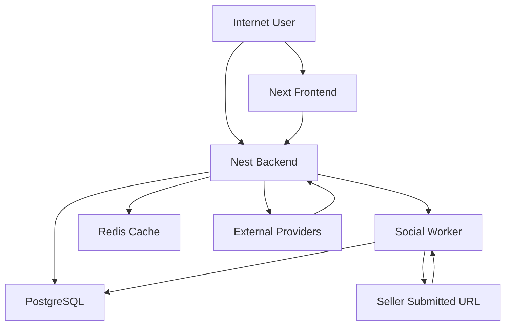

# LUK Threat Model

Date: 2026-04-29

## Executive summary

LUK is not yet running in production and is currently calibrated for local development and QA with no real user or KYC/payment data, which materially lowers immediate operational risk. Even with that calibration, the repository already contains several pre-production blockers for a future public rollout: bearer tokens are passed through OAuth callback URLs and browser storage, seller-submitted social-promotion URLs can cause backend or worker-side fetch/Playwright execution with weak hostname validation, and refresh tokens are stored in plaintext in the database. Those three themes dominate the near-term AppSec roadmap more than lower-severity hardening gaps because they directly affect authentication integrity, server-side trust boundaries, and session theft risk.

## Scope and assumptions

In-scope paths:

- `backend/src`
- `backend/prisma/schema.prisma`
- `frontend/src`
- `frontend/next.config.ts`
- Root runtime docs and env defaults that influence deployed behavior

Out-of-scope items:

- Tests, fixtures, and E2E scaffolding except where they clarified runtime behavior
- CI/CD platform configuration outside repository code
- Cloud account, WAF, VPC, and managed-platform controls not visible in repo

Explicit assumptions used for ranking:

- Current environment is local dev/QA, not public production.
- No real user, KYC, or payment data is processed today.
- When deployed in the future, the app is intended to be internet-facing with public buyers/sellers, public raffle pages, and authenticated dashboards.
- Future hosted deployments may include frontend, backend, Redis, PostgreSQL, and a background social-worker, based on repo docs and service split.
- Outbound network restrictions for backend/social-worker are unknown and not visible in repo configuration.

Open questions that would materially change risk ranking:

- Will hosted backend/social-worker environments block outbound access to private, loopback, link-local, and metadata IP ranges?
- Will future production use same-site auth cookies or keep cross-subdomain token passing semantics?

## System model

### Primary components

- Next.js frontend serving public pages, auth flows, dashboards, checkout screens, and admin UI. Evidence anchors: `frontend/README.md`, `frontend/src/app/**`, `frontend/next.config.ts`.
- NestJS backend exposing GraphQL plus REST endpoints for OAuth, payment status, webhooks, uploads, health, social-promotion tracking, and Mercado Pago connect. Evidence anchors: `backend/README.md`, `backend/src/main.ts`, `backend/src/app.module.ts`.
- PostgreSQL via Prisma storing users, refresh tokens, raffles, tickets, disputes, wallet/payment state, seller KYC/address fields, mock payments, and social-promotion records. Evidence anchors: `backend/prisma/schema.prisma`, `backend/package.json`.
- Redis-backed cache layer with in-memory fallback. Evidence anchors: `backend/package.json`, `backend/src/app.module.ts`.
- Social-promotion validation logic that loads public seller-submitted URLs via `fetch` and optionally Playwright, with a separate `social-worker` process documented for scheduled validation. Evidence anchors: `backend/README.md`, `backend/src/social-promotions/social-promotion-page-loader.service.ts`, `backend/src/social-promotions/social-promotions.service.ts`.
- External integrations: Google OAuth, Mercado Pago top-ups and Connect OAuth, Cloudinary uploads, optional Cloudflare Turnstile, Brevo email, and Sentry. Evidence anchors: `backend/README.md`, `frontend/README.md`, `backend/src/auth/auth-google.controller.ts`, `backend/src/payments/mp.controller.ts`, `backend/src/uploads/uploads.controller.ts`.

### Data flows and trust boundaries

- Internet user -> Next.js frontend
  - Data: page requests, auth form input, dashboard actions, checkout actions, query parameters
  - Channel: HTTP(S) when hosted, HTTP in local dev
  - Security guarantees: frontend CSP and headers only in production via `frontend/next.config.ts:53-83`
  - Validation/schema enforcement: mostly server-side after GraphQL/REST submission; client-side forms use React Hook Form/Zod patterns in parts of the app

- Browser -> NestJS backend GraphQL and REST
  - Data: credentials, JWT bearer tokens, refresh tokens, raffle/ticket mutations, uploads signature requests, payment status checks
  - Channel: HTTP(S), WebSocket for GraphQL subscriptions
  - Security guarantees: JWT auth guards, GraphQL complexity limit, global validation pipe, global throttler, CORS, optional Turnstile, Helmet
  - Validation/schema enforcement: Nest DTO validation in `backend/src/main.ts:73-82`; complexity plugin in `backend/src/common/plugins/complexity.plugin.ts`

- Google OAuth / Mercado Pago -> Backend callback and webhook endpoints
  - Data: OAuth codes, state, payment/webhook payloads, status identifiers
  - Channel: HTTP redirects and POST callbacks
  - Security guarantees: OAuth state/PKCE for MP Connect, webhook signature verification when secret configured, public endpoint decorators
  - Validation/schema enforcement: route-level parsing plus custom signature verification in `backend/src/payments/mp.controller.ts`

- Backend -> PostgreSQL
  - Data: users, roles, refresh tokens, KYC/PII, raffle state, tickets, wallet/payment state, social-promotion records
  - Channel: Prisma over DB connection
  - Security guarantees: application-layer authorization before access; selective app-layer encryption for some PII fields when `ENCRYPTION_KEY` is valid
  - Validation/schema enforcement: DTO/service validation before persistence; Prisma schema constraints

- Backend -> Redis/cache
  - Data: cache entries, throttling-adjacent shared state only if implemented outside current login throttler
  - Channel: Redis protocol
  - Security guarantees: availability optimization, not a primary trust boundary for current auth logic
  - Validation/schema enforcement: repo-visible details are limited

- Seller-submitted social URL -> Backend/social-worker fetch and Playwright loader
  - Data: attacker-controlled URL, returned HTML, redirects, visible browser text
  - Channel: outbound HTTP(S) and browser automation
  - Security guarantees: weak hostname classification only; timeout; optional feature flag for browser path
  - Validation/schema enforcement: current hostname checks are substring-based, not a strict allowlist

#### Diagram

## Assets and security objectives

| Asset | Why it matters | Security objective (C/I/A) |
| --- | --- | --- |
| Access tokens and refresh tokens | Compromise enables account takeover and privileged API use | C / I |
| User PII and KYC fields | Repository supports document, address, phone, and payment-account data | C |
| Seller payment-provider credentials | Mercado Pago Connect tokens can affect payout/account integrity | C / I |
| Wallet, ticket, raffle, dispute, and payout state | Core business integrity for purchases, refunds, and seller settlement | I / A |
| Admin capabilities and moderation workflows | Abuse can expose user data or manipulate platform governance | C / I |
| Social-promotion validation pipeline | Can become a server-side network primitive if attacker-controlled | I / A |
| Audit logs and activity history | Important for abuse investigation and security detection | I / A |
| Availability of backend, DB, Redis, and worker | Public raffle browsing, auth, payments, and scheduled validation depend on them | A |

## Attacker model

### Capabilities

- Remote unauthenticated attacker can reach public frontend routes and any public backend endpoints once the app is hosted.
- Authenticated low-privilege user or seller can exercise GraphQL mutations, uploads signature requests, raffle flows, and social-promotion submissions.
- Attacker can manipulate browser-visible data, URLs, and any attacker-originating content stored by the platform.
- Attacker may obtain read access to browser history/storage, proxy logs, screenshots, or development telemetry in lower-trust environments.
- Attacker may eventually reach public OAuth callbacks, webhook endpoints, and payment status/sync routes.

### Non-capabilities

- No assumption of current cloud-account compromise, database shell access, or direct source-code write access.
- No assumption that CI/CD secrets or deployment secrets are already leaked.
- No assumption that current dev machines are internet-exposed in the same way as future production.
- No assumption that attacker already controls private network routing; that remains conditional on future egress policy.

## Entry points and attack surfaces

| Surface | How reached | Trust boundary | Notes | Evidence (repo path / symbol) |
| --- | --- | --- | --- | --- |
| Frontend public pages | Browser navigation | Internet -> frontend | Public search, raffle, seller, checkout status, auth pages | `frontend/README.md`, `frontend/src/app/**` |
| GraphQL HTTP endpoint | `POST /graphql` | Browser -> backend | Main authenticated and public API surface | `backend/README.md`, `backend/src/app.module.ts` |
| GraphQL subscriptions | `WS /graphql` | Browser -> backend | JWT accepted through connection params | `backend/src/app.module.ts:153-181` |
| Google OAuth callback | `GET /auth/google/callback` | Google -> backend | Redirect includes bearer tokens back to frontend | `backend/src/auth/auth-google.controller.ts` |
| Refresh token endpoint | `GET /auth/refresh` | Browser -> backend | Accepts refresh token in header or cookie | `backend/src/auth/auth-google.controller.ts` |
| Mercado Pago webhook | `POST /mp/webhook` | Provider -> backend | Signature verification depends on secret config | `backend/src/payments/mp.controller.ts` |
| Payment status and sync | `GET /mp/payment-status`, `GET /mp/sync-payment/:paymentId` | Browser -> backend | Public, throttled, used to recover from missed webhook flow | `backend/src/payments/mp.controller.ts` |
| Upload signature endpoints | `GET /uploads/signature*` | Authenticated browser -> backend | Enables direct Cloudinary uploads | `backend/src/uploads/uploads.controller.ts` |
| Mercado Pago Connect bootstrap | `GET /mp/connect` | Browser -> backend | Public route that manually accepts token via query/header/cookie | `backend/src/payments/mp-connect.controller.ts` |
| Social-promotion submission and validation | GraphQL mutation plus worker validation | Authenticated seller -> backend/worker -> external sites | Attacker-controlled URL reaches server-side fetch/browser | `backend/src/social-promotions/social-promotions.service.ts`, `backend/src/social-promotions/social-promotion-page-loader.service.ts` |
| Mock-payment checkout endpoints | `/payments/mock/*` | Browser -> backend | Dev/QA flow; dangerous if promoted unintentionally | `backend/src/payments/mock-payments.controller.ts` |

## Top abuse paths

1. Attacker obtains an OAuth callback URL, browser storage snapshot, or XSS foothold -> extracts `token` and `refreshToken` from query string or persisted auth state -> replays them against GraphQL or refresh endpoint -> takes over victim session.
2. Seller submits a crafted permalink hosted on `facebook.com.attacker.tld` or another substring-matching domain -> backend/social-worker fetches it and optionally loads it in Playwright -> attacker gains SSRF-like reach or browser interaction from LUK infrastructure.
3. Attacker gets database read access through a separate bug, backup leak, or admin misuse -> reads plaintext `refresh_tokens.token` values -> replays them to mint new access tokens -> silently persists session access.
4. Future production deploy keeps `GRAPHQL_DEBUG=true` -> attacker intentionally triggers resolver/validation errors -> collects stack-trace or internal error details -> uses them to target deeper application bugs.
5. Password-spraying attacker targets public auth endpoints across multiple app instances -> node-local login throttling does not aggregate globally -> attacker distributes attempts until credential stuffing succeeds.
6. Hosted environment accidentally leaves mock payments enabled -> leaked mock checkout URL token exposes buyer email/payment details and allows public mutation of QA payment state.

## Threat model table

| Threat ID | Threat source | Prerequisites | Threat action | Impact | Impacted assets | Existing controls (evidence) | Gaps | Recommended mitigations | Detection ideas | Likelihood | Impact severity | Priority |
| --- | --- | --- | --- | --- | --- | --- | --- | --- | --- | --- | --- | --- |
| TM-001 | Remote attacker, XSS, local browser compromise, log reader | Victim completes OAuth or refresh flow; attacker can read query strings or browser storage | Steal access/refresh tokens from callback URL or persisted auth state and replay them | Account takeover; admin/session abuse; wallet and profile actions as victim | Auth artifacts, user accounts, admin capabilities, raffle/ticket state | Short access-token TTL and refresh rotation in `backend/src/auth/auth.service.ts:709-758`; cookies are also set in `backend/src/auth/auth-google.controller.ts:65-79` | Tokens are sent in URLs, returned in JSON, and persisted in browser storage | Replace URL token handoff with one-time code exchange or same-site HttpOnly session; never persist refresh tokens client-side; stop returning refresh token to JS | Alert on refresh-token reuse, anomalous IP/device changes, OAuth callback volume, and unexpected admin session creation | Medium in current dev/QA; high once publicly hosted | High | high |
| TM-002 | Authenticated seller | Seller can submit a promotion permalink; outbound egress is not visibly restricted; browser mode may be enabled | Submit attacker-controlled domain that passes substring validation and force backend/worker fetch or Playwright navigation | SSRF, internal network probing, metadata access, increased browser attack surface | Backend/worker network trust, availability, secrets reachable from instance metadata, internal services | Feature flag for browser mode in `backend/src/social-promotions/social-promotion-page-loader.service.ts:31-34`; timeouts exist in `:76-97` | Host allowlist is substring-based; redirects are followed; no visible private-IP rejection; Playwright runs with `--no-sandbox` | Enforce exact host/path allowlists, reject private/link-local/loopback resolutions, revalidate redirects, isolate browser runner, and apply strict egress controls | Log submitted hosts, resolved IPs, redirect chains, and private-IP rejections; alert on unusual destination patterns | Medium | High | high |
| TM-003 | Insider, DB reader, attacker chaining another data leak | Attacker gains read access to the refresh-token table or application logs containing tokens | Replay stored plaintext refresh tokens to mint fresh access tokens | Durable session takeover even without cracking or brute force | Refresh tokens, user sessions, admin sessions | Refresh tokens are high entropy and rotated on use in `backend/src/auth/auth.service.ts:744-758` | Token values are stored plaintext in `backend/prisma/schema.prisma:789-804` | Store only hashed refresh tokens; compare by hashing presented token; add token family metadata and anomaly monitoring | Alert on refresh reuse, unusual token geography, and high-volume refresh failures | Low to medium in current dev; higher if DB is exposed later | High | high |
| TM-004 | Remote attacker exploiting config drift | Future hosted deployment leaves default GraphQL debug behavior enabled | Trigger resolver and validation errors to collect detailed backend internals | Information leakage that improves exploit development and recon | Source paths, resolver logic, schema/validation internals, operational metadata | Introspection is limited to dev landing-page mode in `backend/src/app.module.ts:125-133`; query complexity limit exists | `GRAPHQL_DEBUG` defaults to true in `backend/src/common/config/env.validation.ts:173-180` | Default debug off; assert false in production; sanitize error formatting | Monitor verbose GraphQL error spikes and production debug-enabled startup logs | Medium | Medium | medium |
| TM-005 | Distributed brute-force attacker | Public auth endpoints, password login enabled, multiple app instances or restart churn | Spread login attempts across nodes to bypass node-local counters | Credential stuffing and account takeover | User accounts, admin access | Login throttler exists in `backend/src/common/guards/login-throttler.service.ts`; optional Turnstile in `backend/src/auth/turnstile.service.ts` | Throttling is in-memory only; Turnstile is optional | Move throttling to Redis/shared store; rate-limit per IP and per account; require stronger bot defense at internet edge | Alert on failed-login sprays by IP/account and node-imbalanced auth failures | Medium once public; low in current local-only usage | Medium | medium |
| TM-006 | Misconfiguration plus anyone who gets a mock checkout URL | Mock payments are accidentally enabled in a hosted environment; mock public token leaks via URL/history/local storage | Use leaked public token to inspect and mutate mock payment state | Privacy leakage and QA-flow integrity loss; possible confusion or abuse in demos/staging | Mock payment state, buyer email, operator trust | Feature gating in `backend/src/payments/providers/mock-payment.provider.ts:53-66`; throttling on routes in `backend/src/payments/mock-payments.controller.ts:32-70` | Public bearer-like token in URL; routes are public and not bound to user auth | Fail hard in hosted env if mock payments enabled; remove URL token persistence; add stronger environment segregation | Alert if mock routes are hit outside local environments or in non-dev hostnames | Low | Low to medium | low |

## Criticality calibration

For this repo and current context:

- `critical`
  - Pre-auth remote code execution in backend or worker
  - Auth bypass exposing cross-user or admin data at internet scale
  - Server-side fetch/browser feature that reaches private metadata or control-plane endpoints with realistic internet exposure

- `high`
  - Session takeover through bearer-token leakage or refresh-token theft
  - Plaintext auth artifact disclosure from the database
  - Cross-user wallet, ticket, payout, or dispute integrity compromise

- `medium`
  - Useful error/info leakage that materially improves attacker recon
  - Brute-force resistance that fails under multi-instance or public-hosted conditions
  - Dev/QA-only features that become unsafe under realistic config drift

- `low`
  - Hardening gaps that require a separate exploitable bug first
  - Demo/QA misconfiguration impact without real data or public production exposure
  - Cosmetic header/policy weaknesses with no demonstrated data path to execution

## Focus paths for security review

| Path | Why it matters | Related Threat IDs |
| --- | --- | --- |
| `backend/src/auth/auth-google.controller.ts` | OAuth callback, cookie issuance, URL token handoff, refresh endpoint | TM-001 |
| `backend/src/auth/auth.service.ts` | Access/refresh token lifecycle, rotation, and persistence logic | TM-001, TM-003 |
| `backend/prisma/schema.prisma` | Auth artifact storage, PII/KYC models, mock payment models | TM-003, TM-006 |
| `frontend/src/app/auth/callback/page.tsx` | Client-side token ingestion from query params | TM-001 |
| `frontend/src/store/auth.ts` | Persistent browser storage of auth and refresh tokens | TM-001 |
| `frontend/src/lib/apollo-provider.tsx` | Header-based refresh-token replay and bearer-token propagation | TM-001 |
| `backend/src/social-promotions/parsers/social-promotion-parser.service.ts` | Weak host validation and canonicalization rules | TM-002 |
| `backend/src/social-promotions/social-promotion-page-loader.service.ts` | Outbound fetch/browser behavior, redirects, Playwright launch posture | TM-002 |
| `backend/src/social-promotions/social-promotions.service.ts` | Seller-controlled URL submission and validation workflow | TM-002 |
| `backend/src/payments/mp.controller.ts` | Public webhook/status/sync endpoints and signature assumptions | TM-004 |
| `backend/src/payments/mp-connect.controller.ts` | Public query-token auth path and OAuth bootstrap logic | TM-001, TM-004 |
| `backend/src/common/guards/login-throttler.service.ts` | Brute-force protection design and production limitations | TM-005 |
| `backend/src/common/config/env.validation.ts` | Production-affecting defaults such as GraphQL debug and feature flags | TM-004, TM-006 |
| `backend/src/app.module.ts` | GraphQL runtime config, debug/introspection, global guards | TM-004 |
| `frontend/next.config.ts` | Frontend CSP and browser security-header posture | TM-001 |

## Quality check

- Covered discovered public entry points: GraphQL, WS, OAuth, webhooks, payment status/sync, uploads, MP connect, social promotions, mock payments.
- Represented each major trust boundary at least once: browser to frontend, browser to backend, provider callbacks, backend to DB, backend to worker/external URLs.
- Separated runtime behavior from tests and dev tooling in scope/ranking.
- Reflected user clarifications: dev/QA only, no real data, unknown egress restrictions.
- Left the main open question explicit: future outbound-network restrictions for backend/social-worker.

